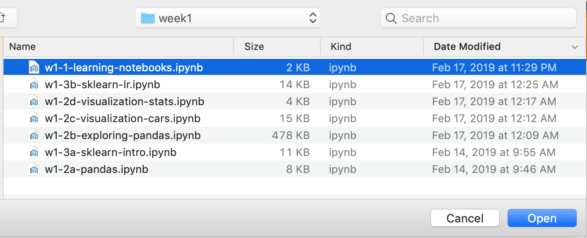
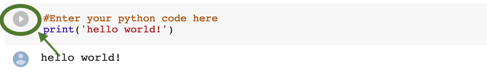
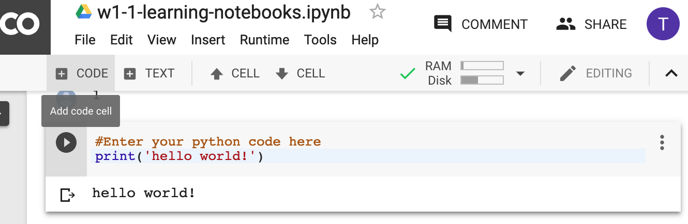

# Using Google Colaboratory

## About

Google Colaboratory is a full-hosted and free service provided by Google which allows you to load and run notebooks for data science, machine 
learning, and deep learning.  It has all the normal packages installed and ready to go.

Within our labs, you have a choice between installing and running your own python environment, or to run in the hosted Colabs format.

## Step 1: Download labs bundle

Download the labs bundle from the link given you for there. It will normally be in a `.zip` format. Unpack the zip file to somewhere convenient, 
such as your desktop. Note that on the MS Windows operating system, simply double clickong on the zip file will *not* extract it.  Instead, you
*must* right click on the `.zip` archive and then say **Extract here.**

## Step 1: Navigate to Google Colaboratory location

Open the following url:

`https://colab.research.google.com/`

[Link](https://colab.research.google.com/)

## Step 2: Click on the upload link

Click on the upload link, as follows:


You will then see the following screen. Select "Choose File".


## Step 3: Navigate to your file.

At this point Chrome will bring up a file requester which is unique to your OS: Finder (For Mac), Windows Explorer (for Windows), etc.  
Navigate to your saved location (for example, your desktop, and then select the downloaded and and extracted folder from your `.zip`
file (**NOT** the `.zip` file itself).

One such notebook is the `LearningNotebooks.ipynb`.  This is a notebook format used by many types of Notebook programs including 
*Jupyter* notebook.



## Step 4: Examine the Loaded Notebook.

This should be the LearningNotebooks notebook. Here you have the notebook loaded into your environment.


## Step 5: Try running a cell of Python code

Find a cell of python code as shown. Click on the "Play button", as shown.  Another way to do this is to click in the cell and press SHIFT and Enter at 
the same time.



Note that the output: Hello World! is printed, as the python code is run.

## Step 6: Open a new cell and write some of your own code.

Let us write some of our own code!  Go ahead nd click on the button on top that says `+ CODE`.  It is as shown



## Step 7: Write some of your own python code in the cell

You should see an empty cell occur.  Click there (if needed) and type some Python code


If you don't know what to type, you can do another `print` statement.

```python
print("Hi back world!")
```

You can again run your code with Shift and Enter, or with pressing the play button as we saw before
